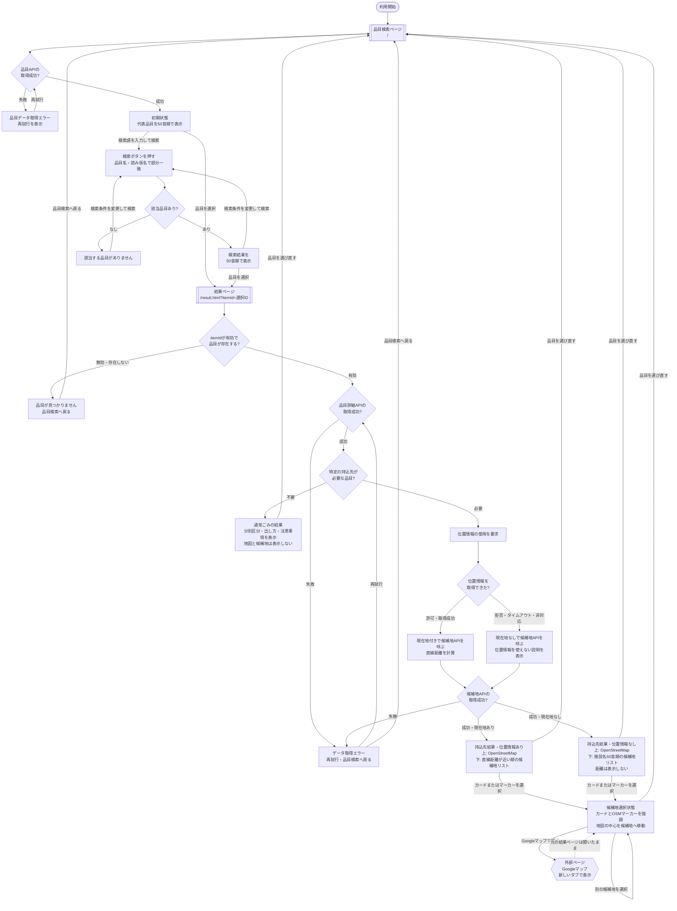

# CODIHA最小機能版 ページ遷移図

## 1. 目的

CODIHA最小機能版における、品目検索から回収方法・持込先の確認までのページ遷移と、各ページ内で発生する重要な状態変化を定義する。

この図は画面構成と利用者の操作フローを決めるための設計資料であり、現時点ではコードやMySQLの変更を伴わない。

## 2. 前提

- アプリ内のページは「品目検索ページ」と「結果ページ」の2ページとする。
- 品目データと候補地データは、最終実装時も現在のMySQL構成を拡張して管理する。
- 最初は代表的な20〜30品目を登録する。正確な品目は機能実装前に別途確定する。
- 品目一覧は読み仮名の50音順で固定表示し、利用者向けの並び替え機能は設けない。
- 検索語を入力して「検索」を押すと、品目名または読み仮名の部分一致で絞り込む。
- 持込先が必要な品目を選択した場合だけ、結果ページで位置情報を要求する。
- 画面内の地図にはOpenStreetMapを使用する。
- Googleマップは、候補地カード内のボタンから新しいタブで開く。
- 結果ページから品目検索ページへ戻った場合、以前の検索語は復元しない。

## 3. ページ遷移図

## 4. 凡例

| 図形 | 意味 | 例 |
| --- | --- | --- |
| 角丸 | フローの開始 | 利用開始 |
| 二重線の四角 | URLが変わるアプリ内ページ | 品目検索ページ、結果ページ |
| 四角 | 同じページ内での表示・処理状態 | 検索結果、通常ごみ結果、候補地選択状態 |
| ひし形 | 条件による分岐 | 該当品目の有無、位置情報取得結果 |
| 六角形 | アプリ外のページ | Googleマップ |
| 実線矢印 | ページ遷移、操作、状態変更 | 品目選択、検索、再試行 |
| 破線矢印 | 外部ページを開いても元ページが残ること | Googleマップから結果ページへの対応 |

## 5. ページ一覧

| ページ | URL案 | 役割 |
| --- | --- | --- |
| 品目検索ページ | `/` | 検索ボックスと50音順の品目一覧を表示する |
| 結果ページ | `/result.html?itemId={id}` | 選択品目の分別方法、または地図と持込先候補を表示する |
| Googleマップ | `https://www.google.com/maps/dir/?api=1&destination={lat},{lng}` | 選択候補地を目的地として新しいタブで表示する |

GoogleマップはCODIHA内部のページではなく外部ページである。

## 6. 遷移表

| 遷移元 | 操作・条件 | 遷移先 | 補足 |
| --- | --- | --- | --- |
| 利用開始 | アプリを開く | 品目検索ページ | 品目APIを呼び出す |
| 品目検索ページ | 品目API成功 | 初期状態 | 代表品目を50音順で表示する |
| 品目検索ページ | 品目API失敗 | 品目データ取得エラー | 「再試行」を表示する |
| 品目データ取得エラー | 再試行 | 品目API呼び出し | 同じページ内で再取得する |
| 初期状態 | 検索語を入力して「検索」 | 検索判定 | 品目名・読み仮名の部分一致 |
| 検索判定 | 該当品目あり | 検索結果 | 50音順を維持する |
| 検索判定 | 該当品目なし | 該当なし状態 | 条件を変更して再検索できる |
| 初期状態・検索結果 | 品目を選択 | 結果ページ | `itemId`をURLへ付ける |
| 結果ページ | `itemId`が不正・品目が存在しない | 品目なし状態 | 品目検索へ戻れる |
| 結果ページ | 品目詳細API失敗 | データ取得エラー | 再試行または品目検索へ戻れる |
| 結果ページ | 持込不要品目 | 通常ごみ結果 | 分別区分・出し方・注意事項を表示する |
| 結果ページ | 持込品目 | 位置情報要求 | この場合だけ位置情報を要求する |
| 位置情報要求 | 許可・取得成功 | 距離計算 | 現在地付きで候補地APIを呼ぶ |
| 位置情報要求 | 拒否・タイムアウト・非対応 | 位置情報なし検索 | 現在地なしで候補地APIを呼ぶ |
| 候補地API | 現在地ありで成功 | 距離順の持込先結果 | OSMが上、候補地リストが下 |
| 候補地API | 現在地なしで成功 | 施設名50音順の持込先結果 | 距離は表示しない |
| 候補地API | 失敗 | データ取得エラー | 再試行または品目検索へ戻れる |
| 持込先結果 | カードまたはOSMマーカーを選択 | 候補地選択状態 | カード・マーカー・地図中心を連動させる |
| 候補地選択状態 | 「Googleマップで開く」 | Googleマップ | 新しいタブで開き、結果ページは残す |
| 結果ページ内の各状態 | 「品目を選び直す」 | 品目検索ページ | 検索語を残さず初期状態へ戻る |

## 7. 画面内の表示順

### 7.1 品目検索ページ

1. ページタイトル・説明
2. 検索ボックス
3. 「検索」ボタン
4. 件数または検索状態
5. 50音順の品目一覧

### 7.2 持込先を表示する結果ページ

1. 選択品目名・回収方法・注意事項
2. 位置情報の状態説明
3. OpenStreetMap
4. 候補地リスト
5. 「品目を選び直す」操作

候補地カードには、施設名、住所、利用時間、取得できた場合のみ直線距離、「Googleマップで開く」ボタンを表示する。

### 7.3 通常ごみの結果ページ

1. 選択品目名
2. 分別区分
3. 出し方
4. 注意事項
5. 「品目を選び直す」操作

地図と候補地リストは表示しない。

## 8. 実装時の確認事項

- Mermaid上では「ページ」と「同一ページ内の状態」を異なる図形で区別する。
- 品目検索ページと結果ページの間だけがCODIHA内部のURL遷移である。
- 検索結果の絞り込み、位置情報要求、候補地選択は同じページ内の状態変更である。
- 位置情報を取得できなくても、候補地を非表示にしない。
- 位置情報ありの場合は直線距離順、なしの場合は施設名の50音順とする。
- OpenStreetMapと候補地リストは同じ結果ページに表示し、地図を上、リストを下に配置する。
- Googleマップは別タブで開き、CODIHAの結果ページを閉じない。
- すべてのAPIエラー状態から再試行または品目検索ページへ戻れるようにする。
