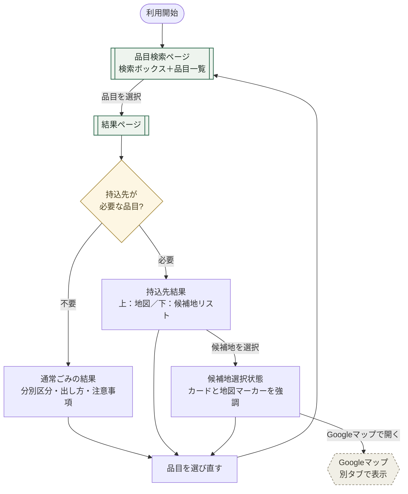
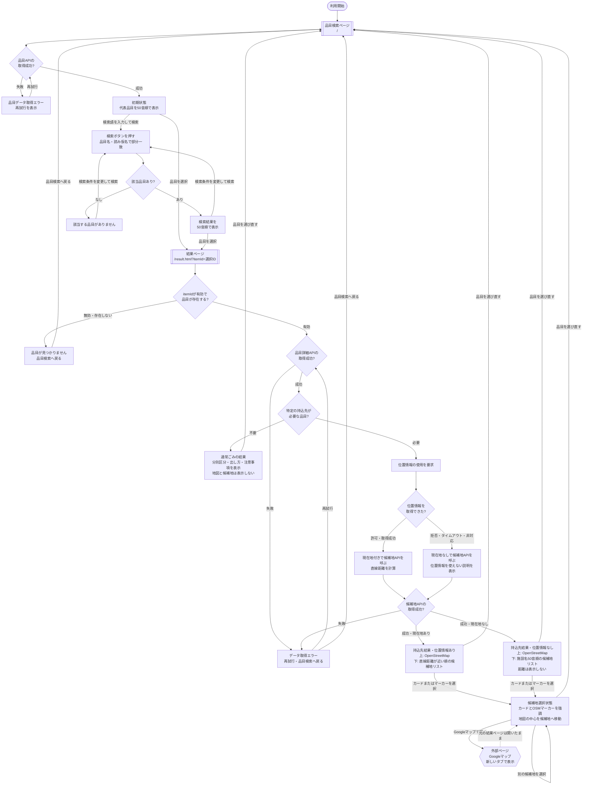

# 概要

このアプリは，千葉市内での，リサイクル回収ボックスの位置を表示する．
使用する言語は，`javascript`，`node`，`Express`，`HTML`，`CSS`である.

# 担当箇所
| 担当者 | 担当箇所 |
| --- | --- |
| 薄井 | UI・UXの設計 |
| 大久保 | UI・UXの設計 |
| 梅澤 | フロントエンド設計 |
| 大菅 | データベースの設計 |

# 機能仕様

- ユーザーの現在地から，回収ボックス設置場所までの，直線距離の計算を行う
- ゴミの一覧をソートせずに表示する．
- ゴミのデータは，`MySQL`でデータベース管理をする．
- 特定の場所に持ち込む必要がある場合は，その場所を現在地から距離の近い順に一覧表示する．
- ユーザーは，候補地をクリックすると，その場所がGoogleマップで表示される．
- 候補地は，リストとGoogleマップの両方で表示される．レイアウトは，リストが下，Googleマップが上に表示される．
- ユーザーは，ゴミの一覧が50音順で表示される．
- ユーザーは，検索ボックスを使うことで，ゴミの品目を検索できる．

# ページ遷移

品目検索から回収方法・持込先の確認までの画面遷移を，簡易版と詳細版の2種類で示す．簡易版は人の操作フローだけを追った概要図，詳細版はAPI成否・エラー処理・位置情報の許可／拒否まで含めた設計資料である．用途に応じて使い分ける．

## 簡易版

主要な画面遷移だけを示した図．API成否判定・エラー画面・再試行・位置情報の許可／拒否分岐などの詳細な状態遷移は含まない．全体の流れをざっと把握したいときに参照する．

### 図の説明（簡易版）

アプリ内の画面は「品目検索ページ」と「結果ページ」の2つのみである．利用者はまず品目検索ページで検索ボックスと50音順の品目一覧から目的の品目を選び，結果ページに遷移する．結果ページでは，選んだ品目が持込先を必要としない通常ごみであれば分別区分・出し方・注意事項を表示するだけで完結する．一方，持込先が必要な品目であれば，上に地図・下に候補地リストを表示する「持込先結果」画面になり，候補地を選ぶとその候補地がカードと地図マーカーの両方で強調される「候補地選択状態」に変わる．この状態から「Googleマップで開く」を選ぶと，別タブでGoogleマップが開く（結果ページ自体は閉じない）．どの結果表示からも「品目を選び直す」で品目検索ページに戻れる．この図では，API通信の成否やエラー時の再試行，位置情報の許可・拒否による分岐は捨象しており，あくまで人がどの画面をどの順にたどるかだけを表している．

### 画面一覧（簡易版）

| 画面 | 役割 |
| --- | --- |
| 品目検索ページ | 検索ボックスと50音順の品目一覧を表示する |
| 結果ページ | 持込不要なら分別方法を表示，持込必要なら地図と候補地一覧を表示する |
| Googleマップ | 選択した候補地を別タブのGoogleマップで表示する（外部ページ） |

## 詳細版

CODIHA最小機能版における，品目検索から回収方法・持込先の確認までのページ遷移と，各ページ内で発生する重要な状態変化を定義した設計資料．コードやMySQLの変更を伴わない設計段階のドキュメントとして，`feat/umezwa` ブランチの `documents/ページ遷移図.md` から転記したもの．

### 前提

- アプリ内のページは「品目検索ページ」と「結果ページ」の2ページとする．
- 品目データと候補地データは，最終実装時も現在のMySQL構成を拡張して管理する．
- 最初は代表的な20〜30品目を登録する．正確な品目は機能実装前に別途確定する．
- 品目一覧は読み仮名の50音順で固定表示し，利用者向けの並び替え機能は設けない．
- 検索語を入力して「検索」を押すと，品目名または読み仮名の部分一致で絞り込む．
- 持込先が必要な品目を選択した場合だけ，結果ページで位置情報を要求する．
- 画面内の地図にはOpenStreetMapを使用する．
- Googleマップは，候補地カード内のボタンから新しいタブで開く．
- 結果ページから品目検索ページへ戻った場合，以前の検索語は復元しない．

### ページ遷移図（詳細版）

### 図の説明（詳細版）

利用開始後，アプリはまず品目APIを呼び出す．取得に失敗すればエラー表示から再試行でき，成功すれば品目検索ページの初期状態として代表品目が50音順で並ぶ．検索語を入力して検索を押すと品目名・読み仮名の部分一致で絞り込み，該当なしの場合も条件を変えて再検索できる．初期状態・検索結果のどちらからでも品目を選ぶと結果ページへ遷移し，`itemId` が無効・品目が存在しない場合は品目検索へ戻される．品目詳細APIの取得に失敗すればここでも再試行または品目検索への復帰ができる．

取得に成功すると，持込不要な品目は分別区分・出し方・注意事項だけを表示する通常ごみの結果で完結する．持込が必要な品目では，まず位置情報の使用を要求し，許可・取得成功なら現在地付きで候補地APIを呼んで直線距離を計算し，拒否・タイムアウト・非対応なら現在地なしで候補地APIを呼ぶ．候補地APIが失敗すればデータ取得エラーとなり，成功すれば現在地の有無に応じて「距離が近い順の候補地リスト（位置情報あり）」または「施設名50音順の候補地リスト，距離非表示（位置情報なし）」のどちらかが，OpenStreetMapとともに表示される．候補地カードまたは地図上のマーカーを選ぶと候補地選択状態になり，カード・マーカー・地図中心が連動して強調表示に切り替わる．ここから「Googleマップで開く」を選ぶと新しいタブでGoogleマップが開き，元の結果ページは開いたままになる．どの結果状態からも「品目を選び直す」を選ぶと，検索語を保持せず品目検索ページの初期状態に戻る．

このように詳細版は，通信の成否・エラー時の挙動・位置情報の許可／拒否といった，実装時に必ず判断が必要になる分岐までを含めて定義しており，簡易版で示した主要フローの背後にある条件分岐を補う位置づけの資料である．

### 凡例

| 図形 | 意味 | 例 |
| --- | --- | --- |
| 角丸 | フローの開始 | 利用開始 |
| 二重線の四角 | URLが変わるアプリ内ページ | 品目検索ページ，結果ページ |
| 四角 | 同じページ内での表示・処理状態 | 検索結果，通常ごみ結果，候補地選択状態 |
| ひし形 | 条件による分岐 | 該当品目の有無，位置情報取得結果 |
| 六角形 | アプリ外のページ | Googleマップ |
| 実線矢印 | ページ遷移，操作，状態変更 | 品目選択，検索，再試行 |
| 破線矢印 | 外部ページを開いても元ページが残ること | Googleマップから結果ページへの対応 |

### ページ一覧

| ページ | URL案 | 役割 |
| --- | --- | --- |
| 品目検索ページ | `/` | 検索ボックスと50音順の品目一覧を表示する |
| 結果ページ | `/result.html?itemId={id}` | 選択品目の分別方法，または地図と持込先候補を表示する |
| Googleマップ | `https://www.google.com/maps/dir/?api=1&destination={lat},{lng}` | 選択候補地を目的地として新しいタブで表示する |

GoogleマップはCODIHA内部のページではなく外部ページである．

### 遷移表

| 遷移元 | 操作・条件 | 遷移先 | 補足 |
| --- | --- | --- | --- |
| 利用開始 | アプリを開く | 品目検索ページ | 品目APIを呼び出す |
| 品目検索ページ | 品目API成功 | 初期状態 | 代表品目を50音順で表示する |
| 品目検索ページ | 品目API失敗 | 品目データ取得エラー | 「再試行」を表示する |
| 品目データ取得エラー | 再試行 | 品目API呼び出し | 同じページ内で再取得する |
| 初期状態 | 検索語を入力して「検索」 | 検索判定 | 品目名・読み仮名の部分一致 |
| 検索判定 | 該当品目あり | 検索結果 | 50音順を維持する |
| 検索判定 | 該当品目なし | 該当なし状態 | 条件を変更して再検索できる |
| 初期状態・検索結果 | 品目を選択 | 結果ページ | `itemId`をURLへ付ける |
| 結果ページ | `itemId`が不正・品目が存在しない | 品目なし状態 | 品目検索へ戻れる |
| 結果ページ | 品目詳細API失敗 | データ取得エラー | 再試行または品目検索へ戻れる |
| 結果ページ | 持込不要品目 | 通常ごみ結果 | 分別区分・出し方・注意事項を表示する |
| 結果ページ | 持込品目 | 位置情報要求 | この場合だけ位置情報を要求する |
| 位置情報要求 | 許可・取得成功 | 距離計算 | 現在地付きで候補地APIを呼ぶ |
| 位置情報要求 | 拒否・タイムアウト・非対応 | 位置情報なし検索 | 現在地なしで候補地APIを呼ぶ |
| 候補地API | 現在地ありで成功 | 距離順の持込先結果 | OSMが上，候補地リストが下 |
| 候補地API | 現在地なしで成功 | 施設名50音順の持込先結果 | 距離は表示しない |
| 候補地API | 失敗 | データ取得エラー | 再試行または品目検索へ戻れる |
| 持込先結果 | カードまたはOSMマーカーを選択 | 候補地選択状態 | カード・マーカー・地図中心を連動させる |
| 候補地選択状態 | 「Googleマップで開く」 | Googleマップ | 新しいタブで開き，結果ページは残す |
| 結果ページ内の各状態 | 「品目を選び直す」 | 品目検索ページ | 検索語を残さず初期状態へ戻る |

### 画面内の表示順

**品目検索ページ**

1. ページタイトル・説明
2. 検索ボックス
3. 「検索」ボタン
4. 件数または検索状態
5. 50音順の品目一覧

**持込先を表示する結果ページ**

1. 選択品目名・回収方法・注意事項
2. 位置情報の状態説明
3. OpenStreetMap
4. 候補地リスト
5. 「品目を選び直す」操作

候補地カードには，施設名，住所，利用時間，取得できた場合のみ直線距離，「Googleマップで開く」ボタンを表示する．

**通常ごみの結果ページ**

1. 選択品目名
2. 分別区分
3. 出し方
4. 注意事項
5. 「品目を選び直す」操作

地図と候補地リストは表示しない．

### 実装時の確認事項（詳細版）

- Mermaid上では「ページ」と「同一ページ内の状態」を異なる図形で区別する．
- 品目検索ページと結果ページの間だけがCODIHA内部のURL遷移である．
- 検索結果の絞り込み，位置情報要求，候補地選択は同じページ内の状態変更である．
- 位置情報を取得できなくても，候補地を非表示にしない．
- 位置情報ありの場合は直線距離順，なしの場合は施設名の50音順とする．
- OpenStreetMapと候補地リストは同じ結果ページに表示し，地図を上，リストを下に配置する．
- Googleマップは別タブで開き，CODIHAの結果ページを閉じない．
- すべてのAPIエラー状態から再試行または品目検索ページへ戻れるようにする．

## 確認事項（仕様.md からは断定できない点）

- 一覧の並び順：仕様.md には「ゴミの一覧をソートせずに表示する」と「ゴミの一覧が50音順で表示される」が併記されている．詳細版では50音順で確定させているが，仕様.md 本文の矛盾は未解消．
- 候補地クリック時の遷移方法：仕様.md では「Googleマップで表示される」としか書かれていない．詳細版では画面内はOpenStreetMap，Googleマップは別タブという役割分担で具体化しているが，仕様.md 本文とは表記が異なる．
- 品目一覧画面と持込先画面の関係：すべての品目が持込先を持つのか，一部の品目のみ持込先画面へ遷移するのかは，詳細版でも「特定の持込先が必要な品目」という条件分岐として扱われており，対象品目の具体的な線引きは別途確定が必要．
