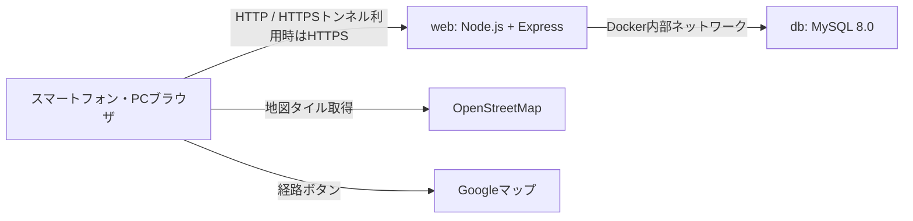

# CODIHA試作品 仕様書

- 文書更新日: 2026年9月1日
- 対象ディレクトリ: `CODIHA/prototype/`
- バージョン: `0.1.0`
- 種別: ハッカソン用試作品

## 1. 目的

千葉市内に設置されている一般小型家電の回収場所を、スマートフォンやPCから確認できるようにする。

利用者が位置情報の使用を許可した場合は、現在地から各回収場所までの直線距離を計算し、近い順に表示する。位置情報を利用できない場合でも、全回収場所の地図と一覧を利用できるようにする。

## 2. 対象範囲

### 2.1 対応する機能

- 千葉市内30か所の一般小型家電回収場所の表示
- OpenStreetMap上での回収場所表示
- ブラウザによる現在地取得
- 現在地から回収場所までの直線距離計算
- 直線距離が近い順での並び替え
- 地図マーカーと施設カードの連動
- Googleマップの経路検索画面への遷移
- 位置情報を取得できない場合の全拠点表示
- 地図を読み込めない場合の一覧表示継続
- MySQLへ接続できない場合のエラー表示と再読み込み
- WebとMySQLのヘルスチェック

### 2.2 対応しない機能

- 品目名による検索
- 充電池の回収可否判定
- 携帯電話・タブレット・パソコン専用回収の判定
- 道路に沿った移動距離や移動時間の計算
- 営業中・営業時間外の自動判定
- 休館日や年末年始の自動判定
- 回収場所の登録・編集・削除を行う管理画面
- 利用者アカウント、ログイン、権限管理
- お気に入り、検索履歴、利用履歴の保存
- 公式サイトからのデータ自動取得・自動更新
- 本番公開用のドメイン、HTTPS、監視、バックアップ

## 3. システム構成



Docker Composeで次の2サービスを起動する。

| サービス | 役割 | 使用技術 | 外部公開 |
| --- | --- | --- | --- |
| `web` | HTML・CSS・JavaScriptの配信とAPI提供 | Node.js 20、Express 5 | Macのポート`3000` |
| `db` | 回収場所30件の保存 | MySQL 8.0 | Docker内部のみ |

## 4. 使用技術

| 分類 | 技術 |
| --- | --- |
| サーバー | Node.js 20以上 |
| Webフレームワーク | Express 5 |
| データベース | MySQL 8.0 |
| MySQL接続 | mysql2 |
| 地図ライブラリ | Leaflet 1.9.4 |
| 地図データ | OpenStreetMap |
| コンテナ | Docker、Docker Compose |
| 自動テスト | Node.js標準テストランナー |

## 5. 利用者の基本操作

### 5.1 初期表示

1. ブラウザでアプリを開く。
2. `GET /api/sites`を呼び出す。
3. MySQLから全30拠点を取得する。
4. 千葉市公式ページの掲載順で一覧を表示する。
5. 地図上に全30拠点のマーカーを表示する。

初期表示では距離を表示しない。

### 5.2 現在地から探す

1. 利用者が「現在地から探す」を押す。
2. ブラウザが位置情報の使用許可を求める。
3. 許可された場合、緯度・経度を取得する。
4. `GET /api/sites?lat={緯度}&lng={経度}`を呼び出す。
5. APIが全拠点との直線距離を計算する。
6. 距離が近い順に施設カードと地図マーカーを並べ直す。
7. 地図に現在地と近い回収場所を表示する。

位置情報取得時のブラウザ設定は次のとおり。

| 項目 | 値 |
| --- | --- |
| 高精度取得 | 有効 |
| タイムアウト | 10秒 |
| キャッシュ位置情報の許容時間 | 60秒 |

### 5.3 位置情報を取得できない場合

次の場合はエラー画面へ移動せず、説明文と全30拠点を表示する。

- 利用者が位置情報を拒否した
- 10秒以内に位置情報を取得できなかった
- ブラウザが位置情報機能に対応していない
- HTTP接続など、安全な接続として扱われず位置情報を利用できない
- 端末側の位置情報サービスが無効になっている

### 5.4 施設の選択

- 「地図で見る」を押すと、該当施設のカードを強調し、地図を施設位置へ移動する。
- 地図マーカーを押すと、該当施設のカードを強調して一覧内までスクロールする。
- 選択したマーカーは青色で強調する。
- 選択した施設のポップアップに施設名と住所を表示する。

### 5.5 Googleマップで経路を確認する

施設カードの「Googleマップで経路」を押すと、新しいタブで次の形式のURLを開く。

```text
https://www.google.com/maps/dir/?api=1&destination={緯度},{経度}
```

目的地には住所文字列ではなく、MySQLに登録した施設の緯度・経度を使用する。

## 6. 画面仕様

### 6.1 画面構成

上から次の順に表示する。

1. ヘッダー
2. メインメッセージ
3. 「現在地から探す」ボタン
4. 回収対象に関する注意
5. OpenStreetMap
6. 回収場所一覧
7. データ出典と試作品表記

### 6.2 施設カード

各施設カードには次を表示する。

- 順位または公式掲載順
- 区名
- 施設名
- 現在地を取得した場合のみ直線距離
- 住所
- 公式の利用時間
- 「地図で見る」ボタン
- 「Googleマップで経路」リンク

利用時間は公式表記を表示し、現在営業中かどうかの判定は行わない。

### 6.3 地図

- Leafletを使用する。
- 背景地図にはOpenStreetMapの地図タイルを使用する。
- 初期表示では千葉市全体と30拠点が収まる範囲を表示する。
- 現在地取得後は現在地と距離が近い5拠点が収まる範囲を表示する。
- 現在地は青い円で表示する。
- 現在地取得後の施設マーカーには距離順位を表示する。
- 現在地がない場合の施設マーカーは丸印で表示する。
- OpenStreetMapの帰属表示を地図上に表示する。

### 6.4 地図読み込み失敗時

次の場合でも施設一覧は利用可能とする。

- Leafletを読み込めなかった
- OpenStreetMapの地図タイル取得が複数回失敗した

地図部分には「地図を読み込めませんでした。下の一覧はそのまま利用できます。」と表示する。

### 6.5 レスポンシブ表示

- スマートフォン優先のデザインとする。
- 画面幅720px以上では施設カードを2列で表示する。
- 画面幅520px以下ではカード内ボタンを縦に並べる。
- 約375px幅のスマートフォンで横スクロールが発生しない構成とする。
- ボタンの高さは原則46〜48px以上とし、タップしやすくする。

### 6.6 アクセシビリティ

- 日本語のページとして`lang="ja"`を指定する。
- 一覧へ移動するスキップリンクを設置する。
- 状態メッセージに`aria-live`を使用する。
- データ取得エラーに`role="alert"`を使用する。
- 地図マーカーを施設名で読み上げられるようにする。
- キーボードで地図マーカーを選択可能にする。
- OSで動きを減らす設定が有効な場合、アニメーションを抑制する。

## 7. API仕様

### 7.1 `GET /api/sites`

位置情報を指定せず、全30拠点を公式掲載順で取得する。

#### 正常レスポンス

- HTTPステータス: `200`
- `origin`: `null`
- `distanceKm`: 含めない

```json
{
  "count": 30,
  "origin": null,
  "sites": [
    {
      "id": 1,
      "displayOrder": 1,
      "name": "千葉市役所 1階ロビー（受付近く）",
      "ward": "中央区",
      "address": "千葉市中央区千葉港1-1",
      "hoursText": "【平日】9時00分～17時00分",
      "latitude": 35.607302,
      "longitude": 140.106375,
      "sourceUrl": "https://www.city.chiba.jp/kankyo/junkan/haikibutsu/kogatakadenn.html",
      "sourceCheckedAt": "2026-08-07",
      "coordinateSourceUrl": "https://www.city.chiba.jp/sogoseisaku/shichokoshitsu/kohokocho/map_opendata.html",
      "coordinateCheckedAt": "2025-06-27"
    }
  ]
}
```

### 7.2 `GET /api/sites?lat={緯度}&lng={経度}`

指定された位置から各拠点までの直線距離を計算し、近い順で取得する。

#### 正常レスポンス

- HTTPステータス: `200`
- `origin`: 指定された緯度・経度
- 各施設に`distanceKm`を追加
- `distanceKm`はkm単位で小数第2位まで

```json
{
  "count": 30,
  "origin": {
    "latitude": 35.607302,
    "longitude": 140.106375
  },
  "sites": [
    {
      "id": 1,
      "displayOrder": 1,
      "name": "千葉市役所 1階ロビー（受付近く）",
      "latitude": 35.607302,
      "longitude": 140.106375,
      "distanceKm": 0
    }
  ]
}
```

### 7.3 座標検証

次の場合はHTTPステータス`400`を返す。

- `lat`と`lng`の片方しか指定されていない
- 値が空文字
- 数値に変換できない
- 緯度が`-90`未満または`90`を超える
- 経度が`-180`未満または`180`を超える

```json
{
  "error": "緯度または経度の値が正しくありません。"
}
```

### 7.4 `GET /api/health`

Webが応答可能で、MySQLへ接続できるか確認する。

#### MySQL接続成功

- HTTPステータス: `200`

```json
{
  "status": "ok",
  "web": "ok",
  "database": "connected"
}
```

#### MySQL接続失敗

- HTTPステータス: `503`

```json
{
  "status": "error",
  "web": "ok",
  "database": "unavailable"
}
```

### 7.5 その他のAPI

存在しない`/api/`配下へアクセスした場合はHTTPステータス`404`を返す。

```json
{
  "error": "APIが見つかりません。"
}
```

### 7.6 MySQL障害時

回収場所取得中にMySQLエラーが発生した場合、HTTPステータス`503`を返す。

```json
{
  "error": "回収場所データを取得できませんでした。時間をおいて、もう一度お試しください。"
}
```

画面にはエラー内容と「もう一度読み込む」ボタンを表示する。

## 8. 距離計算仕様

- Haversine式を使用する。
- 地球半径は`6371.0088km`とする。
- 道路や建物を考慮しない2点間の直線距離とする。
- 並び替えには丸める前の距離を使用する。
- 表示する距離はkm単位で小数第2位へ丸める。
- 距離が同じ場合は公式掲載順を使用する。

## 9. MySQL仕様

### 9.1 データベース

- DBMS: MySQL 8.0
- デフォルトデータベース名: `codiha`
- 文字コード: `utf8mb4`
- 照合順序: `utf8mb4_0900_ai_ci`
- 初期登録件数: 30件

### 9.2 テーブル

テーブル名: `collection_sites`

| カラム | 型 | 必須 | 説明 |
| --- | --- | --- | --- |
| `id` | `INT UNSIGNED` | 必須 | 自動採番の主キー |
| `display_order` | `TINYINT UNSIGNED` | 必須 | 公式掲載順、重複不可 |
| `name` | `VARCHAR(160)` | 必須 | 施設名・設置場所 |
| `ward` | `VARCHAR(20)` | 必須 | 区名 |
| `address` | `VARCHAR(180)` | 必須 | 住所 |
| `hours_text` | `VARCHAR(180)` | 必須 | 公式の利用時間表記 |
| `latitude` | `DECIMAL(10,7)` | 必須 | 緯度 |
| `longitude` | `DECIMAL(10,7)` | 必須 | 経度 |
| `source_url` | `VARCHAR(500)` | 必須 | 回収場所・利用時間の出典 |
| `source_checked_at` | `DATE` | 必須 | 出典確認日 |
| `coordinate_source_url` | `VARCHAR(500)` | 必須 | 座標の出典 |
| `coordinate_checked_at` | `DATE` | 必須 | 座標データ確認日 |

### 9.3 初期データ登録

- `db/init.sql`をMySQLコンテナの初回作成時に実行する。
- 外部サイトへアクセスして自動取得する処理はない。
- Dockerボリュームがすでに存在する場合、`init.sql`は再実行されない。
- 日本語の文字化けを防ぐため、登録前に`SET NAMES utf8mb4`を実行する。

### 9.4 データ永続化

- MySQLデータはDockerの名前付きボリューム`db_data`に保存する。
- コンテナを停止してもデータは残る。
- `docker compose down`でも名前付きボリュームは通常残る。
- `docker compose down --volumes`を実行すると試作品のMySQLデータも削除される。

## 10. データ出典

### 10.1 回収場所・住所・利用時間

- 出典: [千葉市「小型家電とリチウムイオン電池などの充電式電池の回収」](https://www.city.chiba.jp/kankyo/junkan/haikibutsu/kogatakadenn.html)
- 確認日: 2026年8月7日
- 対象: 一般小型家電に対応する30拠点

### 10.2 緯度・経度

- 出典: [千葉市「公共施設位置情報」](https://www.city.chiba.jp/sogoseisaku/shichokoshitsu/kohokocho/map_opendata.html)
- データ時点: 2025年6月27日
- ライセンス表記: CC BY 4.0

### 10.3 地図

- 地図データ: OpenStreetMap contributors
- 地図上に帰属表示を掲載する。

## 11. Docker仕様

### 11.1 Webコンテナ

- ベースイメージ: `node:20-alpine`
- 実行ユーザー: `node`
- 起動コマンド: `node src/server.js`
- コンテナ内ポート: `3000`
- Mac側ポート: `3000`
- 本番依存パッケージのみ`npm ci --omit=dev`でインストールする。

### 11.2 MySQLコンテナ

- イメージ: `mysql:8.0`
- MySQLのポートはMac側へ公開しない。
- 5秒間隔でヘルスチェックを実行する。
- MySQLが正常になるまでWebコンテナを起動しない。

### 11.3 環境変数

| 環境変数 | デフォルト値 | 用途 |
| --- | --- | --- |
| `MYSQL_DATABASE` | `codiha` | データベース名 |
| `MYSQL_USER` | `codiha` | アプリ接続ユーザー |
| `MYSQL_PASSWORD` | `codiha_dev` | アプリ接続パスワード |
| `MYSQL_ROOT_PASSWORD` | `codiha_root_dev` | MySQL管理パスワード |
| `PORT` | `3000` | Web待受ポート |
| `DB_HOST` | `db` | Webから見たMySQLホスト名 |
| `DB_PORT` | `3306` | MySQLポート |
| `DB_NAME` | `MYSQL_DATABASE`と同じ | 接続先DB名 |
| `DB_USER` | `MYSQL_USER`と同じ | 接続ユーザー |
| `DB_PASSWORD` | `MYSQL_PASSWORD`と同じ | 接続パスワード |

デフォルトの認証値はローカル開発専用であり、本番環境では使用しない。

## 12. 位置情報とプライバシー

- 位置情報は「現在地から探す」を押した場合だけ要求する。
- 取得した緯度・経度は距離計算のためAPIへ送信する。
- 現在の実装では位置情報をMySQLへ保存しない。
- 利用者を識別するID、Cookie、ログイン情報は使用しない。
- Expressのアクセスログ機能は追加していない。
- 外部HTTPSトンネルを利用する場合、通信はトンネル提供者を経由する。
- ブラウザの位置情報APIは、原則としてHTTPSまたは同一端末の`localhost`で利用する。

## 13. セキュリティ上の位置づけ

- ハッカソン用のローカル試作品である。
- ログインやアクセス制限はない。
- APIは認証なしで呼び出せる。
- 施設データは公開情報のみを扱う。
- MySQLはDocker内部に限定し、Macやインターネットへ直接公開しない。
- Expressの`X-Powered-By`ヘッダーは無効にする。
- 画面へ埋め込む施設データはHTMLエスケープする。
- Googleマップと出典リンクは`noopener noreferrer`を指定して新しいタブで開く。
- 本番公開する場合はHTTPS、アクセス制限、ログ方針、監視、バックアップ、強い認証情報の設計が別途必要になる。

## 14. エラー処理

| 状況 | 利用者への動作 |
| --- | --- |
| 位置情報を拒否 | 説明を表示し、全30拠点を表示 |
| 位置情報取得タイムアウト | 説明を表示し、全30拠点を表示 |
| 位置情報非対応 | 説明を表示し、全30拠点を表示 |
| Leaflet読み込み失敗 | 地図エラーを表示し、一覧は継続 |
| 地図タイル取得失敗 | 地図エラーを表示し、一覧は継続 |
| MySQL接続失敗 | データ取得エラーと再読み込みボタンを表示 |
| 不正な緯度・経度 | APIが`400`を返す |
| 未定義API | APIが`404`を返す |

## 15. テスト仕様

`npm test`で9件の自動テストを実行する。

### 15.1 APIテスト

- 位置情報なしで公式掲載順になること
- 位置情報ありで距離順になること
- 表示距離が同じでも、丸める前の距離で並ぶこと
- 緯度・経度が片方だけの場合に`400`になること
- 空の緯度・経度が`400`になること
- 範囲外の緯度・経度が`400`になること
- MySQL相当の障害時に`503`になること
- ヘルスチェックがWebとMySQLの状態を返すこと

### 15.2 距離計算テスト

- 同じ座標の距離が`0km`になること
- 千葉市役所と中央区役所の距離が約`1.47km`になること
- 緯度・経度の有効範囲を正しく判定すること

### 15.3 手動確認済み項目

- Docker ComposeによるWeb・MySQLの初回起動
- MySQLへの30件登録
- 日本語が文字化けしないこと
- 約375px幅のスマートフォン表示
- PCでの2列表示
- 横方向へはみ出さないこと
- 位置情報拒否時の全拠点表示
- 地図とカードの連動
- Googleマップリンク
- MySQL停止時のエラー表示
- MySQL復旧後の再読み込み
- 地図マーカーを施設名で読み上げられること

自動テストは実際のブラウザ、実際のGPS、実際のMySQLコンテナを使用しない。これらは手動またはDocker起動確認で補う。

## 16. 起動・停止方法

### 16.1 初回起動

```bash
cd /Users/umezawasota/CODIHA/prototype
cp .env.example .env
docker compose up --build
```

アクセス先:

```text
http://localhost:3000
```

### 16.2 バックグラウンド起動

```bash
docker compose up --build --detach
```

### 16.3 停止

データとコンテナを残して停止する。

```bash
docker compose stop
```

### 16.4 再開

```bash
docker compose start
```

### 16.5 コンテナとネットワークを終了・削除

```bash
docker compose down
```

名前付きボリューム`db_data`は残る。

## 17. スマートフォン・外部端末からの確認

### 17.1 同じWi-Fi内

MacのローカルIPを使い、次の形式でアクセスする。

```text
http://{MacのローカルIP}:3000
```

画面と一覧は確認できるが、HTTP接続ではスマートフォンの位置情報を取得できない場合がある。

### 17.2 離れた場所または位置情報を含む確認

Cloudflare Quick Tunnelなどで一時的なHTTPS URLを発行する。

```bash
cloudflared tunnel --url http://localhost:3000
```

発行された`https://...trycloudflare.com`を確認者へ共有する。これは試験用の一時公開であり、CODIHA試作品自体にはCloudflare Tunnelの設定を含めていない。

## 18. ファイル構成

```text
prototype/
├── .dockerignore
├── .env.example
├── Dockerfile
├── README.md
├── SPECIFICATION.md
├── compose.yaml
├── package.json
├── package-lock.json
├── db/
│   └── init.sql
├── public/
│   ├── index.html
│   ├── styles.css
│   └── app.js
├── src/
│   ├── distance.js
│   ├── http-app.js
│   ├── server.js
│   └── site-repository.js
└── test/
    ├── api.test.js
    └── distance.test.js
```

### 18.1 主要ファイルの役割

| ファイル | 役割 |
| --- | --- |
| `compose.yaml` | WebとMySQLの構成、環境変数、起動順序 |
| `Dockerfile` | Webコンテナの作成 |
| `db/init.sql` | テーブル作成と30拠点の初期登録 |
| `src/server.js` | MySQL接続とExpress起動 |
| `src/http-app.js` | API、静的ファイル配信、入力検証 |
| `src/site-repository.js` | MySQLからの施設取得と接続確認 |
| `src/distance.js` | Haversine式による距離計算 |
| `public/index.html` | 画面構造 |
| `public/styles.css` | デザインとレスポンシブ表示 |
| `public/app.js` | API呼び出し、位置情報、地図、カード操作 |
| `test/api.test.js` | APIの自動テスト |
| `test/distance.test.js` | 距離計算の自動テスト |

## 19. 利用上の注意

- `public/index.html`をファイルとして直接開かない。
- 必ずExpressを起動し、`http://localhost:3000`またはHTTPSトンネルURLからアクセスする。
- OpenStreetMapの地図表示にはインターネット接続が必要になる。
- Googleマップの経路表示にもインターネット接続が必要になる。
- 公式データは固定登録のため、千葉市の情報が更新されても自動では反映されない。
- 本番サービスとして利用する前に、公式情報の再確認と運用設計が必要になる。
